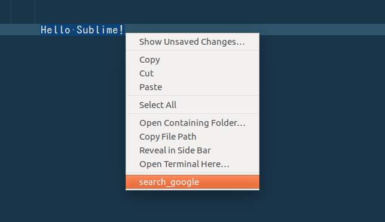

Sublime-Text 3 google search plugin
===

It is a simple plugin that specifies an area and search its content using google  

## Demo

area specification -> right click -> search_google

<center></center>


## Requirement

Only Sublime Text 3

## Install

#### Manual

```
$ cd .config/sublime-text-3/Packages
$ git clone https://github.com/agodoriru/Sublime-rightclick_google_search_plugin.git
```

## Author

[@AG0D0R1RV](https://twitter.com/AG0D0R1RV)
